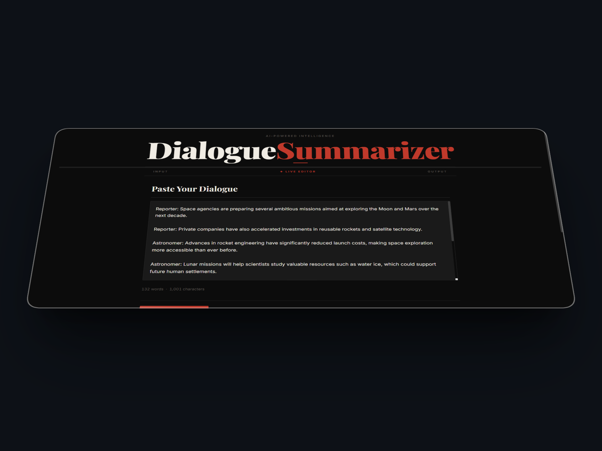
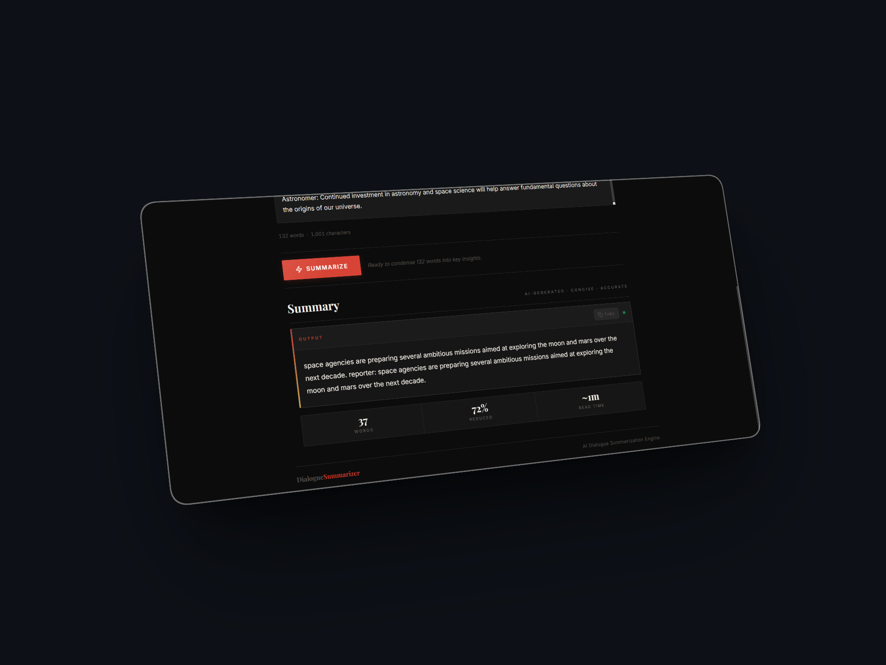

# 🗣️ Dialogue Summarizer

A full-stack AI application that automatically summarizes conversations and dialogues using a custom fine-tuned model trained on the **SAMSum** dataset.

---

## 📸 Screenshots





---

## 📁 Project Structure

```
dialouge-summarizer/
├── backend/          # FastAPI server — exposes summarization API
├── frontend/         # Next.js app — user interface
├── training/         # Model training notebook, datasets & saved model
├── .gitignore
└── README.md
```

---

## 🧠 How It Works

1. **Training** — A transformer model is fine-tuned on the SAMSum dialogue-summary dataset inside a Jupyter Notebook.
2. **Backend** — The saved model is loaded by a FastAPI server and served via a `/summarize` REST endpoint.
3. **Frontend** — A Next.js UI lets users paste a dialogue, hit **Summarize**, and view the generated summary in real time.

---

## 🚀 Getting Started

### Prerequisites

| Tool | Version |
|------|---------|
| Python | ≥ 3.9 |
| Node.js | ≥ 18 |
| npm / yarn | latest |

---

### 1 — Backend (FastAPI)

```bash
cd backend

# Create & activate virtual environment
python -m venv venv
# Windows
venv\Scripts\activate
# macOS / Linux
source venv/bin/activate

# Install dependencies
pip install -r requirements.txt

# Run the server
uvicorn app:app --reload
```

Server runs at `http://localhost:8000`.

---

### 2 — Frontend (Next.js)

```bash
cd frontend
npm install
npm run dev
```

App runs at `http://localhost:3000`.

---

### 3 — Training

Open `training/dialogue-summarizer.ipynb` in **Jupyter** or **VS Code** and run all cells.  
The fine-tuned model is saved to `training/final_model/`.

> **Note:** Dataset CSV files and model weights are listed in `.gitignore` and are **not committed** to this repository due to their large size. Download the SAMSum dataset separately or from HuggingFace: [`samsum`](https://huggingface.co/datasets/samsum).

---

## 🛠️ Tech Stack

- **Model** — HuggingFace Transformers (fine-tuned on SAMSum)
- **Backend** — FastAPI + Uvicorn
- **Frontend** — Next.js (React)
- **Dataset** — [SAMSum Corpus](https://huggingface.co/datasets/samsum)